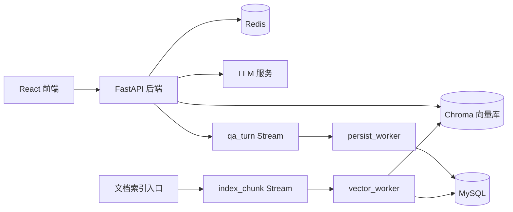

# 企业知识库 RAG 问答系统

一个面向企业文档问答场景的全栈 RAG 应用。项目围绕“把本地/企业文档变成可追溯的知识问答助手”展开，覆盖文档解析、向量索引、语义检索、查询改写、重排、会话记忆、异步任务、持久化存储和前端交互界面。

这个仓库不是只调用大模型 API 的最小示例，而是一次完整的 AI 应用工程实践：前端、后端、向量库、缓存队列、关系型数据库、后台 worker、Docker 和基础质量检查都被串成了一套可运行系统。

## 项目预览

> 建议在最终提交作品集时，把这里替换成前端页面截图。

- 用户可以直接在网页中提问。
- 系统基于已索引文档检索相关片段。
- 回答会附带参考内容，方便追溯来源。
- 支持历史会话、清空会话、导出 Markdown / JSON。
- 前端隐藏工程参数，界面面向普通使用者。

本地开发预览地址通常为：

```text
http://127.0.0.1:5174
```

## 核心功能

- **文档知识库构建**：支持 PDF、DOCX、PPTX、HTML、Markdown 等文档加载与切分。
- **语义检索问答**：使用 Chroma 存储向量，并在回答前检索相关上下文。
- **查询改写与重排**：对用户问题进行改写，并对候选片段进行 rerank，提高回答相关性。
- **可追溯回答**：前端展示参考内容，帮助用户知道答案依据来自哪里。
- **会话记忆**：Redis 保存短期上下文，MySQL 持久化会话和消息。
- **异步索引与持久化**：Redis Streams 驱动后台 worker，避免慢任务阻塞主请求。
- **可靠性设计**：包含幂等键、重试计数、死信队列、trace_id 贯穿 API、队列、worker 和数据库。
- **工程化交付**：提供 Docker Compose、Alembic 迁移、pytest、Ruff、Mypy、GitHub Actions。

## 技术栈

| 模块 | 技术 |
|---|---|
| 前端 | React, Vite, Ant Design |
| 后端 | FastAPI, Uvicorn, Pydantic |
| RAG 编排 | LangChain 相关组件 |
| 向量库 | Chroma |
| 缓存与队列 | Redis, Redis Streams |
| 持久化 | MySQL, PyMySQL |
| 数据库迁移 | Alembic |
| 文档解析 | PDF / DOCX / PPTX / HTML / Markdown loaders |
| 工程质量 | Pytest, Ruff, Mypy, GitHub Actions |
| 部署 | Docker, Docker Compose, Nginx |

## 系统架构



更详细的架构说明见：[docs/ARCHITECTURE.md](docs/ARCHITECTURE.md)

## 运行方式

复制环境变量模板：

```powershell
Copy-Item .env.example .env
```

启动完整服务：

```powershell
docker compose up -d --build
```

访问服务：

- 前端：`http://127.0.0.1`
- 后端健康检查：`http://127.0.0.1:8000/api/health`

开发模式：

```powershell
docker compose -f docker-compose.yml -f docker-compose.dev.yml up -d --build
```

## 本地开发

安装后端依赖：

```powershell
pip install -r requirements.txt
```

安装前端依赖：

```powershell
cd frontend
npm ci
```

启动后端：

```powershell
uvicorn rag.main:app --reload --host 127.0.0.1 --port 8000
```

启动前端：

```powershell
cd frontend
npm run dev -- --host 127.0.0.1 --port 5174
```

启动后台 worker：

```powershell
python -m rag.workers.persist_worker
python -m rag.workers.vector_worker
```

## 演示流程

仓库中包含示例文档：

```text
data/samples/
```

可以先索引示例文档：

```powershell
python -m rag.indexes.index_manager "data/samples/基于CNN的论坛验证码识别实验报告.docx"
```

也可以通过 Redis Streams 走异步索引：

```powershell
python -m rag.indexes.index_manager --async-index "data/samples/基于CNN的论坛验证码识别实验报告.docx"
python -m rag.workers.vector_worker
```

然后在前端提问，例如：

```text
这份实验报告主要研究了什么问题？
系统用了哪些模型或方法？
实验流程可以总结成哪几步？
```

## API 示例

健康检查：

```http
GET /api/health
```

问答接口：

```http
POST /api/qa
Content-Type: application/json

{
  "question": "这份文档主要讲了什么？",
  "session_id": "demo-session"
}
```

读取会话消息：

```http
GET /api/session/{session_id}/messages
```

清空会话短期记忆：

```http
DELETE /api/session/{session_id}
```

## 质量检查

```powershell
ruff check .
pytest -q
cd frontend
npm run build
```

已配置 GitHub Actions，包含后端 lint、类型检查、测试、前端构建和 Docker Compose 配置校验。

## 项目亮点

- 从 0 到 1 实现完整 RAG 应用，而不是停留在单脚本问答。
- 前后端分离，前端面向真实用户，不暴露检索参数。
- 使用 Redis Streams 将主请求链路和持久化/索引任务解耦。
- 使用 MySQL 保存会话、消息、文档和 embedding 元数据。
- 使用幂等键、重试、死信队列处理 worker 可靠性问题。
- 使用 trace_id 串联 API、队列事件、worker 日志和持久化记录。
- 有 Docker、CI、测试、lint、迁移脚本等基础工程化能力。

## 简历写法参考

**企业知识库 RAG 问答系统**  
独立开发一个面向企业文档问答的 RAG 应用，基于 FastAPI、React、Chroma、Redis、MySQL 实现文档解析、向量索引、语义检索、查询改写、重排问答、会话记忆与参考内容追溯；支持异步索引任务、历史会话管理、Markdown/JSON 导出，并使用 Docker Compose、CI、pytest 和 Ruff 完成基础工程化建设。

更多面试讲述点见：[docs/PROJECT_HIGHLIGHTS.md](docs/PROJECT_HIGHLIGHTS.md)

## 注意事项

- 不要提交 `.env` 或真实 API Key。
- Chroma 数据、运行日志和构建产物不应作为源码提交。
- 如果本地 `5173` 被 Docker/WSL 中的旧前端占用，可以使用 `5174` 作为 Vite 开发端口。
