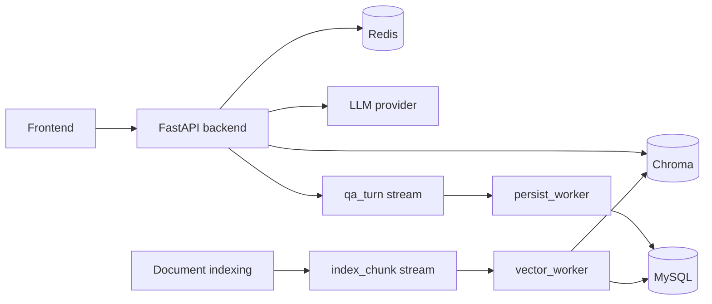

# RAG Knowledge Base QA

A full-stack Retrieval-Augmented Generation project with document ingestion, semantic retrieval, asynchronous indexing, durable chat history, and Docker-based deployment.

This repository is designed as a practical engineering project rather than a minimal demo. It shows how to connect a FastAPI backend, React frontend, Chroma vector storage, Redis Streams, MySQL persistence, background workers, Alembic migrations, and CI quality gates into one coherent system.

## Features

- Ask questions against an indexed knowledge base.
- Retrieve and rerank context chunks before calling the LLM.
- Store short-term session memory and retrieval snapshots in Redis.
- Persist conversations, messages, documents, and embedding metadata in MySQL.
- Index documents synchronously or through asynchronous Redis Stream events.
- Run dedicated workers for QA persistence and vector indexing.
- Track requests with `trace_id` across API logs, events, workers, and persisted metadata.
- Run the full stack with Docker Compose.

## Architecture



More detail: [docs/ARCHITECTURE.md](docs/ARCHITECTURE.md)

Resume-oriented summary: [docs/PROJECT_HIGHLIGHTS.md](docs/PROJECT_HIGHLIGHTS.md)

## Tech Stack

| Layer | Technology |
|---|---|
| Backend API | FastAPI, Uvicorn, Pydantic |
| Frontend | React, Vite, Ant Design |
| Vector store | Chroma, LangChain integration |
| Queue/cache | Redis, Redis Streams |
| Durable storage | MySQL, PyMySQL |
| Migrations | Alembic |
| Document parsing | PDF, DOCX, PPTX, HTML, Markdown loaders |
| Quality | Pytest, Ruff, Mypy, GitHub Actions |
| Deployment | Docker, Docker Compose, Nginx frontend image |

## Quick Start With Docker

Copy the environment template and fill in provider keys if needed:

```powershell
Copy-Item .env.example .env
```

Start the production-like stack:

```powershell
docker compose up -d --build
```

Open:

- Frontend: `http://127.0.0.1`
- Backend health: `http://127.0.0.1:8000/api/health`

For local development with backend reload and Vite dev server:

```powershell
docker compose -f docker-compose.yml -f docker-compose.dev.yml up -d --build
```

Development frontend: `http://127.0.0.1:5173`

## Local Development

Install backend dependencies:

```powershell
pip install -r requirements.txt
```

Install frontend dependencies:

```powershell
cd frontend
npm ci
```

Run backend:

```powershell
uvicorn rag.main:app --reload --host 127.0.0.1 --port 8000
```

Run frontend:

```powershell
cd frontend
npm run dev
```

Run workers:

```powershell
python -m rag.workers.persist_worker
python -m rag.workers.vector_worker
```

## Indexing Documents

Synchronous indexing:

```powershell
python -m rag.indexes.index_manager data/samples/example.pdf
```

Asynchronous indexing through Redis Streams:

```powershell
python -m rag.indexes.index_manager --async-index data/samples/example.pdf
```

## API

Health check:

```http
GET /api/health
```

Ask a question:

```http
POST /api/qa
Content-Type: application/json

{
  "question": "What does this knowledge base say about the topic?",
  "session_id": "demo-session",
  "top_k": 6,
  "top_n": 4
}
```

Load persisted messages:

```http
GET /api/session/{session_id}/messages
```

Clear short-term session memory:

```http
DELETE /api/session/{session_id}
```

## Quality Checks

```powershell
ruff check rag tests scripts alembic
mypy rag tests --ignore-missing-imports
pytest -q
cd frontend
npm run build
```

The GitHub Actions workflow runs these checks for pull requests and pushes.

After starting the Docker stack, run a local smoke check:

```powershell
python scripts/smoke_check.py
```

## Data And Persistence

- Redis stores short-term chat memory, retrieval snapshots, event streams, and worker retry state.
- Chroma stores vectors for semantic search.
- MySQL stores durable conversation, message, document, and embedding metadata.
- Alembic manages schema migrations under `alembic/versions`.

## Notes

- Do not commit `.env` or real API keys.
- Chroma data and generated logs are intentionally ignored by Git.
- Docker uses separate frontend development and production image targets.
