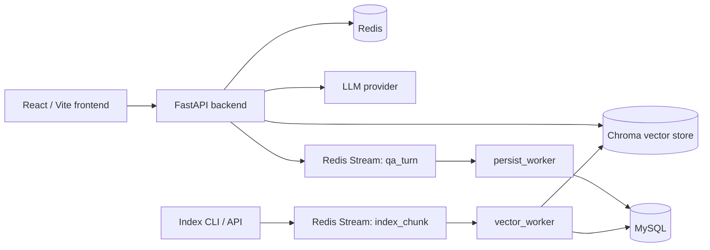

# Architecture

This project is a full-stack RAG knowledge-base QA system. The backend is organized around a synchronous query path and two asynchronous persistence/indexing paths.

## Runtime Components

## Query Path

1. The frontend sends a question to `POST /api/qa`.
2. The backend optionally loads short-term session memory from Redis.
3. The question is optionally rewritten, then used to retrieve candidate chunks from Chroma.
4. Retrieved chunks are reranked and formatted into the answer prompt.
5. The LLM response is returned immediately to the caller.
6. If `session_id` is present, the turn is saved to Redis and emitted as a `qa_turn` event for durable persistence.

## Indexing Path

Documents are loaded and chunked by file-type loaders. Chunks can be indexed synchronously for local workflows, or enqueued as `index_chunk` events for background indexing.

The `vector_worker` consumes `index_chunk` events, upserts chunks into Chroma, and mirrors document/embedding metadata into MySQL. It uses idempotency keys so repeated events do not create duplicate durable records.

## Reliability Model

- Redis Streams decouple API latency from durable writes.
- Workers use consumer groups, retry counters, exponential backoff, and dead-letter streams.
- `trace_id` is propagated through API requests, queue events, worker logs, and persisted metadata.
- MySQL schema changes are managed by Alembic migrations.
- Docker Compose runs Redis, MySQL, backend, workers, and frontend as separate services.

## Storage Responsibilities

| Store | Responsibility |
|---|---|
| Redis | Session memory, retrieval snapshots, event streams, retry/idempotency state |
| Chroma | Semantic vector retrieval |
| MySQL | Conversations, messages, documents, embedding metadata |

## Quality Gates

CI runs backend linting, type checks, tests, and frontend production builds. Dockerfiles are split into development and production targets so the same project can support local iteration and deployable images.
